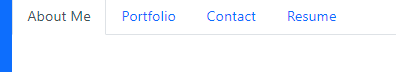
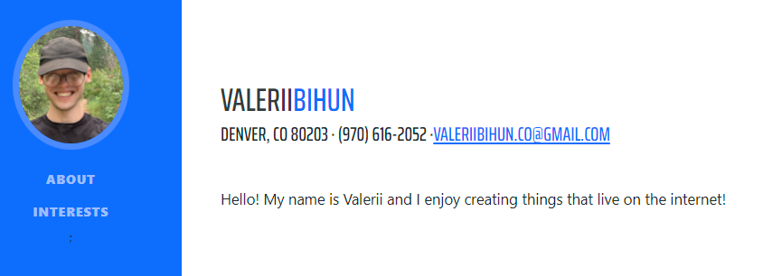
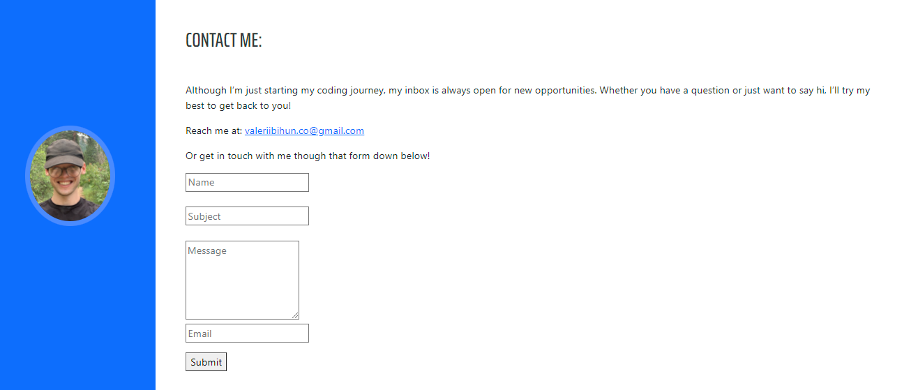
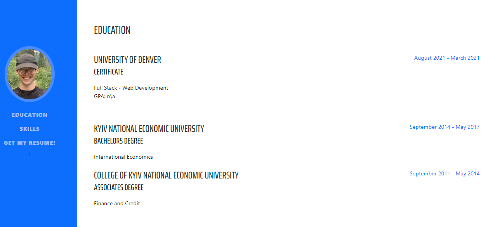

# My React Portfolio

## Description

This is Valerii Bihuns Portfolio built in React! 
A programmer portfolio is more than a simple resume - it showcases and proves that you can do what is mentioned in the resume.

This project is going to be the base of my future portfolio and will be improved as I get more skillful.

## Table of Contents
- [Installation](#installation)
- [Usage](#usage)
- [Credits](#credits)
- [License](#license)
- [Collaborators](#Collaborators)

## Installation
Current project has been saved in my personal GitHub repository and is currently available for cloning and reviews on:

https://github.com/Valllerian/Updated-Portfolio
## Usage

Websites includes some usable links to navigate through content on the top navbar;

 

 

Sidebar has an Avatar and navigation through topic on the page;

 

 

"Contact me" section has the form that sends an email with users message;

 

 

"Resume" section has education and skills;

 

 

Footer of the page with social links;

 

 

## Credits
Following resources  have been used while working on the project:

1) W3Schools has been used to get some more understanding on the code functionality, pseudo classes, img positioning etc:

    https://www.w3schools.com/

2) Bootstrap elements were used (footer\navbar\slides)
    https://getbootstrap.com/docs/5.1/getting-started/introduction/

3) Following ReadMe Tutorial has helped me to write a proper, well-structured ReadMe file:

    https://coding-boot-camp.github.io/full-stack/github/professional-readme-guide

4) List of licenses:

    https://choosealicense.com/

4) Original styling :

   https://startbootstrap.com/theme/resume

## License
Current project is unlicensed. Which means - "Anyone is free to copy, modify, publish, use, compile, sell, or
distribute this software, either in source code form or as a compiled
binary, for any purpose, commercial or non-commercial, and by any
means." (Quote for source #3)

## Collaborators:

Valerii Bihun: valeriibihun.co@gmail.com;
Start Bootstrap themes;
